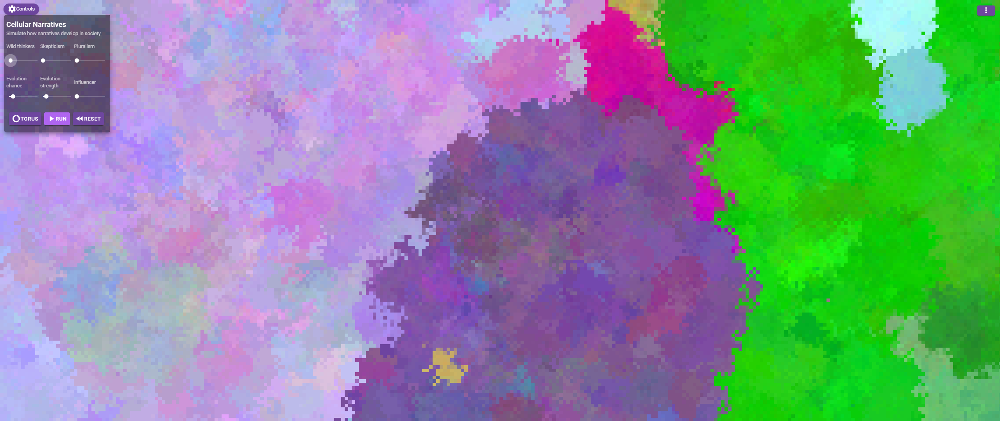
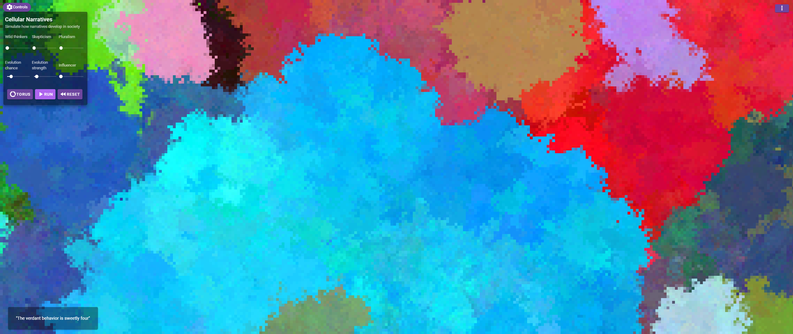

# Cellular Narratives Webapp

## About
Narrative Economics is the study of how narratives convey values and emotions, how they spread like pathogens, thus influence the society and economy. In order to understand recessions, for example, it is not enough to understand the cybernetic control loops behind them, but one must also include the human factor with its irrational, emotionally driven actions. Above all, this includes his belief in stories that create meaning, the narratives. In order to understand history and why people acted the way they did, one must also understand the underlying narratives.
In this project a webapp was developed to simulate the dynamic system behavior of narratives in society using cellular automata. Narratives can emerge spontaneously, evolve, stand in competition or symbiosis with other narratives and can also be forgotten or dismissed. The user can design different forms of societies, such as a pluralistic, populistic or a skeptical society which is skeptical towards any form of societal change.

#### TLDR
Explore the dynamic spread and development of narratives in different social systems.

### Live Demo
https://cellular-narratives.web.app/

### Technical
Created with vue.js, vuetify and parts of cellauto.js.

